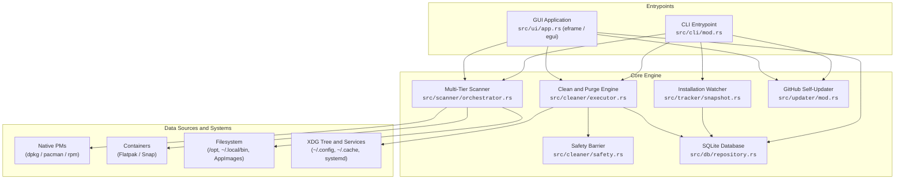
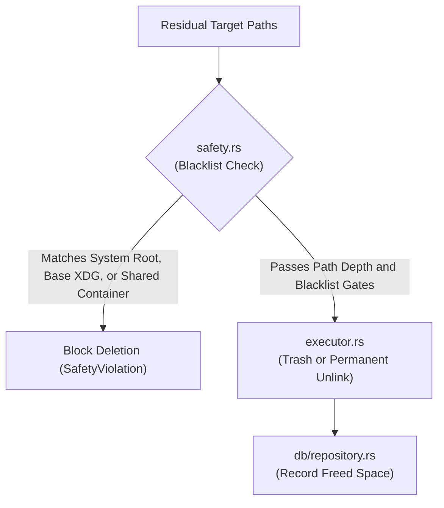
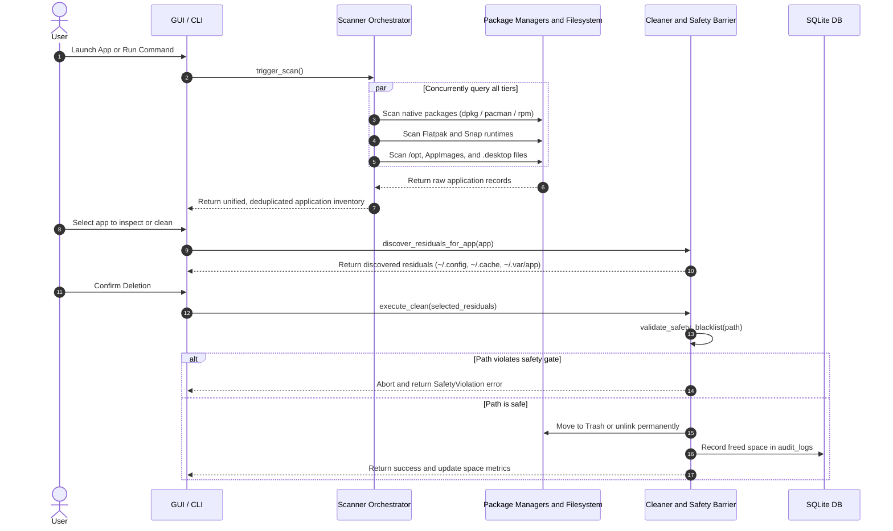

# SweepX Architecture and Contributor Guide

This document describes the internal architecture, subsystems, data flow, and file responsibilities of SweepX.

---

## 1. System Architecture



---

## 2. Subsystem Breakdown

```
src/
├── main.rs                  # Application entry point, CLI routing, and GUI launch
├── lib.rs                   # Library exports and shared module definitions
├── cli/                     # CLI parser, command handlers, and terminal output
├── db/                      # SQLite database connection, schema, and queries
├── models/                  # Core domain models (Application, Artifact, Residual)
├── scanner/                 # Discovery engines across all packaging tiers
│   ├── orchestrator.rs      # Multi-tier async scanner and deduplicator
│   ├── desktop_entry.rs     # Freedesktop .desktop parser and icon resolver
│   ├── flatpak.rs           # Flatpak CLI client and runtime parser
│   ├── snap.rs              # Snap CLI client and revision tracker
│   ├── appimage.rs          # AppImage detector, ELF header parser, and integrator
│   ├── manual.rs            # /opt and ~/.local/bin scanner with package ownership check
│   ├── symlink_graph.rs     # Stow-style symlink graph resolver
│   └── native/              # Package manager clients (dpkg, rpm, pacman)
├── cleaner/                 # Residual detection, safety validator, and executor
│   ├── safety.rs            # Zero-tolerance safety validator and protected path blacklist
│   ├── heuristic.rs         # Isolated container, XDG, and dotdir residual crawler
│   ├── signatures.rs        # Known directory patterns dictionary for complex apps
│   ├── executor.rs          # Reversible Trash and permanent file removal executor
│   ├── privilege.rs         # Root elevation manager via pkexec and sudo
│   └── system_sweep.rs      # System optimizer (old Snaps, unused Flatpaks, package caches)
├── tracker/                 # Filesystem snapshot diffing and install watcher
├── ui/                      # egui / eframe desktop application
│   ├── app.rs               # Main GUI loop and background worker channel receiver
│   ├── theme.rs             # Dark theme tokens, typography, and palette
│   └── views/               # Modal dialogs, dashboard table, optimizer, and audit views
└── updater/                 # Self-updater querying GitHub Releases API
```

---

### 1. Multi-Tier Scanner Engine (`src/scanner/`)

The scanner queries package registries, container runtimes, and local directories concurrently.

| File | Scanner Type | Responsibility |
| :--- | :--- | :--- |
| [`src/scanner/orchestrator.rs`](src/scanner/orchestrator.rs) | `ScannerOrchestrator` | Runs all tier scanners concurrently, applies deduplication rules, and merges desktop launchers with native packages. |
| [`src/scanner/native/apt.rs`](src/scanner/native/apt.rs) | `AptScanner` | Queries Debian/Ubuntu `dpkg-query` and parses status records. |
| [`src/scanner/native/dnf.rs`](src/scanner/native/dnf.rs) | `DnfScanner` | Queries Fedora/RHEL/openSUSE `rpm` database for installed software. |
| [`src/scanner/native/pacman.rs`](src/scanner/native/pacman.rs) | `PacmanScanner` | Queries Arch Linux `pacman -Qi` for local packages. |
| [`src/scanner/flatpak.rs`](src/scanner/flatpak.rs) | `FlatpakScanner` | Parses output from `flatpak list --app` and extracts versions, sizes, and IDs. |
| [`src/scanner/snap.rs`](src/scanner/snap.rs) | `SnapScanner` | Inspects Snap revisions, publisher channels, and package status. |
| [`src/scanner/appimage.rs`](src/scanner/appimage.rs) | `AppImageScanner` | Discovers standalone AppImages, verifies magic bytes, and provides desktop integration. |
| [`src/scanner/manual.rs`](src/scanner/manual.rs) | `ManualScanner` | Crawls `/opt`, `~/.local/bin`, and `~/Applications`. Validates files against an extension blacklist, verifies ELF headers, and checks `rpm -qf`, `dpkg -S`, or `pacman -Qo` to prevent duplicating native packages. |
| [`src/scanner/desktop_entry.rs`](src/scanner/desktop_entry.rs) | `DesktopEntryScanner` | Scans `~/.local/share/applications` and `/usr/share/applications`, extracting Exec commands, Categories, and icon paths. |
| [`src/scanner/symlink_graph.rs`](src/scanner/symlink_graph.rs) | `SymlinkGraph` | Traces symlink graphs in `/usr/local/bin` and `~/.local/bin` to locate target binaries. |

---

### 2. Safety Barrier and Residual Cleaner (`src/cleaner/`)

Every candidate path must pass validation before removal.



| File | Component | Responsibility |
| :--- | :--- | :--- |
| [`src/cleaner/safety.rs`](src/cleaner/safety.rs) | `SafetyValidator` | Validates target paths against protected system roots (`/`, `/usr`, `/etc`), base XDG folders (`~/.config`, `~/.cache`), and shared container repositories (`~/.local/share/flatpak`, `/var/lib/flatpak`, `/var/lib/snapd`, `/usr/bin/flatpak`). |
| [`src/cleaner/heuristic.rs`](src/cleaner/heuristic.rs) | `ResidualCleaner` | Crawls app-specific folders. Enforces container isolation (`~/.var/app/<id>` for Flatpak, `~/snap/<name>` for Snap), evaluates direct dotdirs (`~/.<app>`), and filters out forbidden keywords (`flatpak`, `snap`, `systemd`, `usr`, `bin`). |
| [`src/cleaner/signatures.rs`](src/cleaner/signatures.rs) | `ResidualSignatures` | Dictionary of known directory patterns for applications that place data across multiple non-standard paths (e.g. VS Code, Chrome, Firefox). |
| [`src/cleaner/executor.rs`](src/cleaner/executor.rs) | `DeletionExecutor` | Removes files by moving them to the desktop Trash or by unlinking permanently upon explicit user confirmation. |
| [`src/cleaner/system_sweep.rs`](src/cleaner/system_sweep.rs) | `SystemSweepEngine` | Cleans shared system bloat: removes disabled Snap revisions, runs `flatpak uninstall --unused`, and clears package manager caches. |
| [`src/cleaner/privilege.rs`](src/cleaner/privilege.rs) | `PrivilegeManager` | Manages root elevation requests via `pkexec` or `sudo` when working with system-level paths. |

---

### 3. Installation Watcher (`src/tracker/`)

Tracks files created during manual builds (`make install` or custom install scripts) to allow clean uninstallation later.

| File | Component | Responsibility |
| :--- | :--- | :--- |
| [`src/tracker/snapshot.rs`](src/tracker/snapshot.rs) | `FilesystemSnapshot` | Captures recursive directory trees in `/usr/local`, `~/.local`, and `/opt` before and after an installation command. |
| [`src/tracker/mod.rs`](src/tracker/mod.rs) | `InstallWatcher` | Calculates directory diffs (new and modified files) and writes manifests to the SQLite database. |

---

### 4. Database Storage (`src/db/`)

Embedded SQLite storage for audit history and installation manifests.

| File | Purpose |
| :--- | :--- |
| [`src/db/schema.rs`](src/db/schema.rs) | Manages tables: `install_manifests`, `manifest_files`, and `audit_logs`. |
| [`src/db/repository.rs`](src/db/repository.rs) | Provides methods to store manifests, record uninstallation actions, and compute cumulative disk space recovered. |

---

### 5. User Interface (`src/ui/`)

Desktop interface built on `eframe` and `egui`.

| File | View / Component | Responsibility |
| :--- | :--- | :--- |
| [`src/ui/app.rs`](src/ui/app.rs) | `SweepXApp` | Main event loop, background Tokio channel receiver, and tab management. |
| [`src/ui/theme.rs`](src/ui/theme.rs) | `Theme` | Dark theme styling tokens, spacing rules, and color palette. |
| [`src/ui/views/dashboard.rs`](src/ui/views/dashboard.rs) | `DashboardView` | Application inventory table, packaging tier filter pills, search bar, and summary metric cards. |
| [`src/ui/views/inspector.rs`](src/ui/views/inspector.rs) | `InspectorModal` | Detailed modal displaying installed application payload, discovered user files, and total combined footprint. |
| [`src/ui/views/clean_modal.rs`](src/ui/views/clean_modal.rs) | `CleanModal` | Residual selection list, safety check summary, and uninstallation confirmation. |
| [`src/ui/views/optimizer.rs`](src/ui/views/optimizer.rs) | `OptimizerView` | System bloat cleaner (old Snaps, unused Flatpak runtimes, package manager caches). |
| [`src/ui/views/history.rs`](src/ui/views/history.rs) | `HistoryView` | Audit log timeline and lifetime storage recovery statistics. |

---

### 6. CLI Commands (`src/cli/`)

Headless command-line interface for terminal workflows and scripts.

| File | Purpose |
| :--- | :--- |
| [`src/cli/commands.rs`](src/cli/commands.rs) | Subcommands defined with `clap`: `list`, `inspect`, `clean`, `purge`, `sweep`, `watch`, `update`, and `history`. |
| [`src/cli/mod.rs`](src/cli/mod.rs) | Command execution, terminal tables, JSON output mode, and progress indicators. |

---

### 7. In-Place Self-Updater (`src/updater/`)

| File | Purpose |
| :--- | :--- |
| [`src/updater/mod.rs`](src/updater/mod.rs) | Checks GitHub Releases for new versions, downloads assets, extracts tarballs, and atomically replaces the running binary. |

---

## 3. End-to-End Data Flow



---

## 4. Contributing Guide

### Adding a new package manager scanner:
1. Create `src/scanner/native/<name>.rs` implementing package discovery.
2. Register the scanner in [`src/scanner/orchestrator.rs`](src/scanner/orchestrator.rs).
3. Add a corresponding test file in `tests/`.

### Adding a new system optimizer rule:
1. Add detection logic in [`src/cleaner/system_sweep.rs`](src/cleaner/system_sweep.rs).
2. Wire the rule into `scan_all_sweep_items()` so both the GUI Optimizer tab and `sweepx sweep` CLI pick it up automatically.

---

*Dual-licensed under MIT and Apache-2.0. Copyright (c) Haider Ali Tariq and SweepX Contributors.*
