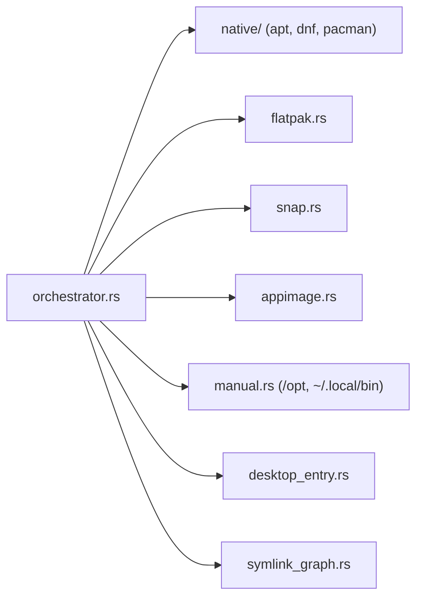
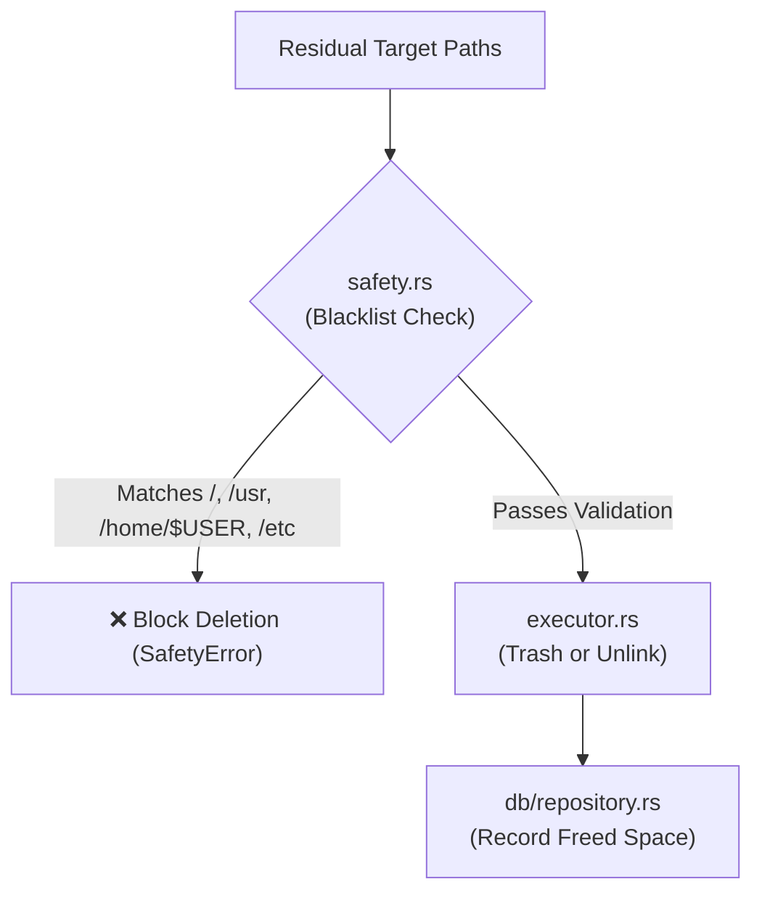
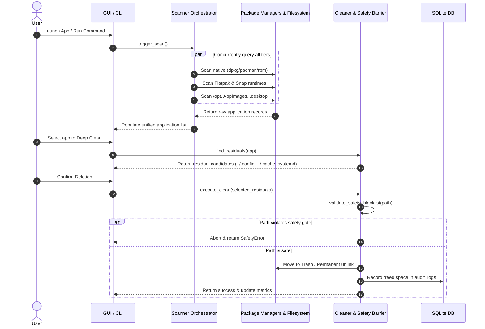

# SweepX Architecture & Contributor Guide

This document maps out the internal architecture, subsystems, data flow, and file responsibilities of **SweepX**. It is designed to help contributors understand how the application works and where to add new features or fixes.

---

## 1. High-Level Architecture Diagram

---

## 2. Subsystem File Map

### 📦 1. Data Models (`src/models/`)
Defines the core data structures passed across scanners, database, and UI.

| File | Primary Structs | Responsibility |
| :--- | :--- | :--- |
| [`src/models/app.rs`](file:///home/haider/Desktop/MyGithub/SweepX/src/models/app.rs) | `Application`, `InstallMethod`, `AppCategory` | Represents an installed software package and its packaging origin. |
| [`src/models/residual.rs`](file:///home/haider/Desktop/MyGithub/SweepX/src/models/residual.rs) | `ResidualCandidate`, `ResidualType`, `ResidualScanResult` | Represents leftover configs, caches, logs, and orphan services. |
| [`src/models/artifact.rs`](file:///home/haider/Desktop/MyGithub/SweepX/src/models/artifact.rs) | `InstalledArtifact`, `SystemSweepItem`, `InstallManifest` | Stores snapshot manifests and system-wide cleanup items. |

---

### 🔍 2. Discovery & Scanners (`src/scanner/`)
Discovers user software across all packaging layers concurrently.

| File | Function / Logic | Responsibility |
| :--- | :--- | :--- |
| [`src/scanner/orchestrator.rs`](file:///home/haider/Desktop/MyGithub/SweepX/src/scanner/orchestrator.rs) | `scan_all_installed_apps()` | Coordinates parallel asynchronous scanning across all tiers. |
| [`src/scanner/native/apt.rs`](file:///home/haider/Desktop/MyGithub/SweepX/src/scanner/native/apt.rs) | `AptScanner` | Queries Debian/Ubuntu `dpkg-query` and formats package records. |
| [`src/scanner/native/dnf.rs`](file:///home/haider/Desktop/MyGithub/SweepX/src/scanner/native/dnf.rs) | `DnfScanner` | Queries Fedora/RHEL `rpm -qa` metadata. |
| [`src/scanner/native/pacman.rs`](file:///home/haider/Desktop/MyGithub/SweepX/src/scanner/native/pacman.rs) | `PacmanScanner` | Queries Arch Linux `pacman -Qi` databases. |
| [`src/scanner/flatpak.rs`](file:///home/haider/Desktop/MyGithub/SweepX/src/scanner/flatpak.rs) | `FlatpakScanner` | Parses user and system Flatpak installations via `flatpak list`. |
| [`src/scanner/snap.rs`](file:///home/haider/Desktop/MyGithub/SweepX/src/scanner/snap.rs) | `SnapScanner` | Inspects Snap revisions, runtimes, and active packages. |
| [`src/scanner/appimage.rs`](file:///home/haider/Desktop/MyGithub/SweepX/src/scanner/appimage.rs) | `AppImageScanner` | Discovers standalone AppImages and extracts embedded icons/metadata. |
| [`src/scanner/manual.rs`](file:///home/haider/Desktop/MyGithub/SweepX/src/scanner/manual.rs) | `ManualScanner` | Crawls `/opt` and `~/.local/bin` for unmanaged binaries. |
| [`src/scanner/desktop_entry.rs`](file:///home/haider/Desktop/MyGithub/SweepX/src/scanner/desktop_entry.rs) | `DesktopEntryScanner` | Parses Freedesktop `.desktop` files, Exec paths, and icon keys. |
| [`src/scanner/symlink_graph.rs`](file:///home/haider/Desktop/MyGithub/SweepX/src/scanner/symlink_graph.rs) | `SymlinkGraph` | Maps symlink graphs and identifies broken / dangling symlinks. |

---

### 🛡️ 3. Safety & Residual Cleaner (`src/cleaner/`)
Validates paths and deletes leftover files safely.

| File | Function / Logic | Responsibility |
| :--- | :--- | :--- |
| [`src/cleaner/safety.rs`](file:///home/haider/Desktop/MyGithub/SweepX/src/cleaner/safety.rs) | `SafetyValidator` | Validates every deletion target against strict blacklists. |
| [`src/cleaner/heuristic.rs`](file:///home/haider/Desktop/MyGithub/SweepX/src/cleaner/heuristic.rs) | `ResidualCleaner` | Heuristic crawler scanning XDG config, cache, share, and systemd units. |
| [`src/cleaner/signatures.rs`](file:///home/haider/Desktop/MyGithub/SweepX/src/cleaner/signatures.rs) | `ResidualSignatures` | Known path patterns dictionary for popular Linux software. |
| [`src/cleaner/executor.rs`](file:///home/haider/Desktop/MyGithub/SweepX/src/cleaner/executor.rs) | `DeletionExecutor` | Executes file removals via reversible Trash or permanent unlinking. |
| [`src/cleaner/system_sweep.rs`](file:///home/haider/Desktop/MyGithub/SweepX/src/cleaner/system_sweep.rs) | `SystemSweepEngine` | Prunes disabled Snap revisions, Flatpak runtimes, and package caches. |
| [`src/cleaner/privilege.rs`](file:///home/haider/Desktop/MyGithub/SweepX/src/cleaner/privilege.rs) | `PrivilegeManager` | Manages root elevation requests via `pkexec` or `sudo`. |

---

### 📸 4. Installation Watcher (`src/tracker/`)
Enables clean uninstallation of software compiled from source (`make install`).

| File | Function / Logic | Responsibility |
| :--- | :--- | :--- |
| [`src/tracker/snapshot.rs`](file:///home/haider/Desktop/MyGithub/SweepX/src/tracker/snapshot.rs) | `FilesystemSnapshot` | Captures recursive directory states before and after an install command. |
| [`src/tracker/mod.rs`](file:///home/haider/Desktop/MyGithub/SweepX/src/tracker/mod.rs) | `InstallWatcher` | Calculates snapshot diffs (created/modified files) and logs manifests. |

---

### 💾 5. Database Layer (`src/db/`)
Embedded SQLite storage with zero server dependencies.

| File | Purpose |
| :--- | :--- |
| [`src/db/schema.rs`](file:///home/haider/Desktop/MyGithub/SweepX/src/db/schema.rs) | Creates tables: `install_manifests`, `manifest_files`, `audit_logs`. |
| [`src/db/repository.rs`](file:///home/haider/Desktop/MyGithub/SweepX/src/db/repository.rs) | High-level API for saving manifests, recording logs, and computing total space freed. |

---

### 🖥️ 6. User Interface (`src/ui/`)
Built with `eframe` (60 FPS hardware-accelerated GUI).

| File | View / Component | Responsibility |
| :--- | :--- | :--- |
| [`src/ui/app.rs`](file:///home/haider/Desktop/MyGithub/SweepX/src/ui/app.rs) | `SweepXApp` | Main event loop, background Tokio channel receiver, and layout shell. |
| [`src/ui/theme.rs`](file:///home/haider/Desktop/MyGithub/SweepX/src/ui/theme.rs) | `Theme` | Dark mode styling, custom font scale, and visual tokens. |
| [`src/ui/views/dashboard.rs`](file:///home/haider/Desktop/MyGithub/SweepX/src/ui/views/dashboard.rs) | `DashboardView` | Application table, category filter pills, search bar, sorting, and metric cards. |
| [`src/ui/views/inspector.rs`](file:///home/haider/Desktop/MyGithub/SweepX/src/ui/views/inspector.rs) | `InspectorModal` | Detailed application metadata viewer & launcher integrator. |
| [`src/ui/views/clean_modal.rs`](file:///home/haider/Desktop/MyGithub/SweepX/src/ui/views/clean_modal.rs) | `CleanModal` | Residual selection checkboxes, safety summary, and purge confirmation. |
| [`src/ui/views/optimizer.rs`](file:///home/haider/Desktop/MyGithub/SweepX/src/ui/views/optimizer.rs) | `OptimizerView` | System-wide bloat sweeper (old Snaps, unused Flatpaks, package caches). |
| [`src/ui/views/history.rs`](file:///home/haider/Desktop/MyGithub/SweepX/src/ui/views/history.rs) | `HistoryView` | Audit log timeline and lifetime disk space recovery metrics. |

---

### 💻 7. CLI Subcommands (`src/cli/`)
Headless automation and scripting interface.

| File | Purpose |
| :--- | :--- |
| [`src/cli/commands.rs`](file:///home/haider/Desktop/MyGithub/SweepX/src/cli/commands.rs) | CLI flag definition via `clap` (`list`, `inspect`, `clean`, `purge`, `sweep`, `watch`, `update`, `history`). |
| [`src/cli/mod.rs`](file:///home/haider/Desktop/MyGithub/SweepX/src/cli/mod.rs) | Terminal output formatting, JSON serialization, and command execution. |

---

### 🔄 8. GitHub Self-Updater (`src/updater/`)
Automated in-place upgrades.

| File | Purpose |
| :--- | :--- |
| [`src/updater/mod.rs`](file:///home/haider/Desktop/MyGithub/SweepX/src/updater/mod.rs) | Queries GitHub Releases API, checks semver, downloads release asset, extracts `.tar.gz` if needed, and atomically swaps the running executable binary. |

---

## 3. End-to-End Data Flow

---

## 4. How to Add a New Feature

### Adding a new Package Manager Scanner:
1. Create `src/scanner/native/<name>.rs` implementing package discovery.
2. Register the scanner in [`src/scanner/orchestrator.rs`](file:///home/haider/Desktop/MyGithub/SweepX/src/scanner/orchestrator.rs).
3. Add a corresponding test file in `tests/`.

### Adding a new System Optimizer rule:
1. Add the detection logic in [`src/cleaner/system_sweep.rs`](file:///home/haider/Desktop/MyGithub/SweepX/src/cleaner/system_sweep.rs).
2. Wire the item into `scan_all_sweep_items()` so both the GUI Optimizer tab and `sweepx sweep` CLI automatically pick it up.

---

*Dual-licensed under MIT and Apache-2.0. Copyright © Haider Ali Tariq and SweepX Contributors.*
