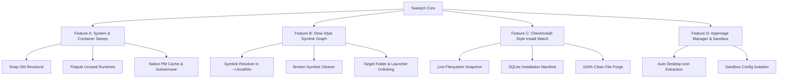

# SweepX Advanced Capabilities Roadmap: Bauh, GNU Stow & CheckInstall Integration

This document outlines the architectural plan for expanding **SweepX** with enterprise-grade package management, container cleanup, symlink tracking, and installation snapshotting.

---

## 1. Resolution to the "Orphan Residual" Safety Question

### Why Previous Heuristics Flagged Active Tools (e.g. Jupyter, SweepX)
* **The Past Issue:** Earlier versions used speculative global directory crawls on `~/.local/share` and `~/.config`. If a directory name didn't match a `.desktop` file launcher, it guessed it was an "orphan", falsely flagging development files like `jupyter`, `learn-duckdb`, or `sweepx`.
* **The Fix in Place Today:** We permanently removed global speculative crawling. Residual discovery in SweepX is now **Target-Bound** (only executed when inspecting or purging a specific, confirmed application).

### Why Feature A (System & Container Sweep) is 100% Safe
Feature A does **not** guess or crawl user workspace folders. It uses deterministic dependency graphs provided by the packaging engines themselves:

| Cleanup Target | Deterministic Mechanism | Safety Guarantee |
| :--- | :--- | :--- |
| **Flatpak Unused Runtimes** | Native engine query: `flatpak list --runtime --unused` | Flatpak inspects its internal dependency tree. A runtime is only flagged if **zero** installed applications require it. |
| **Snap Disabled Revisions** | `snap list --all` filtering for `disabled` flag | Only targets old, superseded squashfs files in `/var/lib/snapd/snaps/`. The currently active revision is untouched. |
| **Native Unused Dependencies** | Package manager graph query (`apt-mark showauto`, `dnf repoquery --unneeded`, `pacman -Qdt`) | Only flags automatic dependency packages whose parent application has already been removed. |
| **Package Download Caches** | Standard package archives (`/var/cache/apt/archives`, `/var/cache/dnf`, `/var/cache/pacman/pkg`) | Reclaims space from installer `.deb` / `.rpm` downloads without touching installed system files. |

---

## 2. Architectural Pillars

---

## 3. Detailed Feature Specifications

### Feature A: System Optimization & Container Sweep *(Inspired by Bauh)*
* **Snap Revision Pruning:**
  * Scan `/var/lib/snapd/snaps/` for disabled revisions.
  * Command integration: `snap remove <snap> --revision=<rev>` or direct unlinking of obsolete `.snap` files.
* **Flatpak Runtime Pruning:**
  * Identify dangling runtimes: `flatpak uninstall --unused --assumeyes`.
* **Package Cache & Autoremove:**
  * Detect size of `/var/cache/apt/archives` / DNF cache / Pacman cache.
  * Execute safe `apt-get clean` / `dnf clean packages` / `pacman -Sc`.
  * Show orphaned system packages with 1-click `autoremove`.
* **UI Integration:** Dedicated **"🧹 System Optimizer"** tab with single-click batch optimization or individual item inspection.

---

### Feature B: Symlink Farm & Manual Install Graph *(Inspired by GNU Stow)*
* **Symlink Resolution:**
  * Scan `~/.local/bin`, `/usr/local/bin`, and `~/.local/share/applications`.
  * For each symlink, resolve `std::fs::read_link` to find destination targets in `/opt`, `~/.local/opt`, or `~/Applications`.
* **Dangling Symlink Detection:**
  * Detect broken symlinks whose target binary was deleted.
* **Coordinated Deep Clean:**
  * When purging an unmanaged application (e.g. `/opt/custom-app`), automatically find and remove all associated symlinks across `PATH` and `.desktop` launchers.

---

### Feature C: Live "Install Watch" Snapshotting *(Inspired by CheckInstall)*
* **Snapshot Engine:**
  * Before installing unmanaged software (e.g. `tar -xzf`, `./install.sh`, `cargo install`, `pip install --user`):
    * Take a fast hash snapshot of target directories: `~/.local/bin`, `~/.local/share`, `~/.config`, `/opt`, `/usr/local`.
  * Run the installer command or user action.
  * Take a post-install snapshot and compute the exact diff: `AddedFiles`, `ModifiedFiles`.
* **Database Manifest:**
  * Store the file manifest in `sweepx.db` associated with the created application.
* **Zero-Residue Purge:**
  * When uninstalling, SweepX iterates through the exact recorded manifest and removes all created files, guaranteeing 100% clean removal of manual installations.

---

### Feature D: AppImage Integration & Sandbox Isolation *(Inspired by Bauh)*
* **Discovery:**
  * Scan `~/Applications`, `~/Downloads`, `~/.local/bin`, `/opt` for standalone `.AppImage` files.
* **1-Click Desktop Integration:**
  * Extract embedded `.DirIcon` / desktop launcher using `--appimage-extract` without running untrusted code.
  * Register `.desktop` file in `~/.local/share/applications` with proper exec paths.
* **Sandbox Data Management:**
  * Map `~/.config/<app>` and `~/.local/share/<app>` created when the AppImage runs and link them to the AppImage entry in SweepX.

---

## 4. Implementation Phasing

| Phase | Deliverable | Key Components |
| :--- | :--- | :--- |
| **Phase 1** | **System Optimizer & Container Sweep** | `src/cleaner/system_sweep.rs`, Snap disabled revisions scanner, Flatpak unused runtimes, new UI view `SystemOptimizerView`. |
| **Phase 2** | **Symlink & Manual Dependency Graph** | `src/scanner/symlink_graph.rs`, broken symlink repair, coordinated `/opt` uninstaller. |
| **Phase 3** | **Live "Install Watch" Manifest Engine** | `src/tracker/snapshot.rs`, SQLite schema expansion (`install_manifests`), CLI `sweepx watch <cmd>`. |
| **Phase 4** | **AppImage Desktop Integrator** | `src/scanner/appimage_integrator.rs`, icon extractor and launcher generator. |
